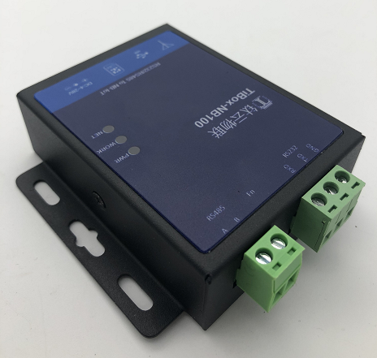

# TiBOX-NB100  NB-IoT可编程数传控制器开发指南


| 条目       | 说明                                       |
| ---------- | ------------------------------------------ |
| 驱动名称   | TiBOX-NB100 NB-IoT可编程数传控制器         |
| 适用       | 适用于钛云物联TiBOX-NB100 可编程数传控制器 |
| 通讯方式   | RS485/RS232                                |
| Java Class | NB100.java                                 |
| 图片       |             |


## TiBOX-NB100  钛极NB-IoT 可编程数传控制器

### 产品介绍 

- 支持标准DTU功能 符合标准NB-IoT协议
- 支持全网通频段 
- 支持RS232/RS485工业总线接入现场设备 
- 支持扩展GPIO进行联动控制  内置TiJVM Java虚拟机
- 支持用户进行功能扩展 支持通过Java语言进行设备协议解析及控制策略
- 提供标准协议库，如Modbus等等 用户可内置多个应用对应不同的应用场景 
- 支持多种云平台, 如电信云,华为云,阿里云等公有云, 以及用户私有云 
- 支持应用OTA, 可通过云端进行应用动态更新和加载 

### 产品优势

#### 可编程, 更多灵活性

支持通过Java语言进行硬件应用开发, 满足工业现场各种工况需求

#### 更多云平台选择, 更高性价比

工业级高性价比硬件
通过在应用中简单设置即可支持各种云平台

#### 端侧应用动态更新/加载

TiBOX支持OTA功能， 应用策略可通过云端动态加载运行，对未知设备协议具备广泛的适应性
降低云端负荷、平衡端云运算能力
将协议处理，数据转换等处理前置至设备端，充分利用端侧计算能力，有效降低云端负荷

#### 云集中式转换为端云配合分布式采集控制

兼顾现场实时性和云端数据处理需求
降低对网络的依赖性，容灾性更强
端侧控制策略更灵活，无需云端中转即可实现联动

## TiBOX-NB100  编程开发说明

TiBOX-NB100 内置钛极OS(TiJOS) 操作系统， 支持通过JAVA语言进行应用开发，可通过钛极OS(TiJOS) 开发工具链IDE进行应用开发， 具体请参考doc.tijos.net

### TiBOX-NB100 Java类使用 说明

tibox.NB100类提供了TiBOX-N100所支持的硬件资源访问， 包括RS485, RS232, NBIOT, GPIO等等， 用户可通过在TiStudio中进行简单的开发即可支持各种应用， 同时基于钛极OS(TiJOS)支持的MODBUS协议类， 可以很方便地与支持MODBUS RTU协议的设备进行数据交互。 

#### NB100 主要方法说明

| 方法                                                         | 说明                                                         |
| ------------------------------------------------------------ | ------------------------------------------------------------ |
| TiSerialPort getRS485(int baudRate, int dataBitNum, int stopBitNum, int parity) | 获取RS485接口， 参数：波特率，数据位，停止位，校验位         |
| TiSerialPort getRS232(int baudRate, int dataBitNum, int stopBitNum, int parity) | 获取RS232接口， 参数：波特率，数据位，停止位，校验位                         |
| void networkConnet(String serverIp, int port)                | 连接NB-IOT云平台， 建议使用电信云。serverIp/port: 电信云平台IP 及端口 |
| void networkCoAPSend(byte[] dataBuffer)                      | 发送数据到云平台, dataBuffer 待发送数据                      |
| void turnOnLED(int id)                                       | 打开指定LED灯                                                |
| void turnOffLED(int id)                                      | 关闭指定LED灯                                                |
| void startFlashLED()                                         | 闪烁指定LED灯                                                |
| void stopFlashLED()                                          | 停止指定LED灯                                                |
| void setNBEventListener                                      | 设置NB-IOT平台数据监听对象                                   |

#### IDeviceEventListener 数据监听

| 方法                                    | 说明                                                         |
| --------------------------------------- | ------------------------------------------------------------ |
| void onCoapDataArrived(byte []message); | 当收到NBIOT云平台COAP协议数据时该接口被调用， meessage为云平台下发数据 |
| void onUDPDataArrived(byte [] packet);  | 当收到NBIOT去平台UDP数据时该接口被调用， 一般不使用该接口    |


### 一般调用过程 - MODBUS RTU为例

**场景**：

设备通过RS485连接到TiBOX-NB100， 通讯MODBUS RTU协议进行数据交互

**设备通讯参数**

| 参数    | 值   |
| ------- | ---- |
| 设备 ID | 1    |
| 波特率  | 9600 |
| 数据位  | 8    |
| 停止位  | 1    |
| 停止位  | 无   |

**寄存器**： INPUT REGISTER  (03)  

| 寄存器地址 | 内容     | 操作权限 | 数值范围                                       |
| ---------- | -------- | -------- | ---------------------------------------------- |
| 0x0000     | 空气湿度 | 只读     | 0x00(0)--0x03E7(999) 对应 0%--99.9% 数值放大了 |
| 0x0001     | 空气温度 | 只读     | 0x8190(-400)--0x0320(800) 对应 -40℃--80℃ 负数  |


#### 代码调用过程

1. 打开RS485并获取TiSerialPort对象

	```java
   //通讯参数
   TiSerialPort rs485 = NB100.getRS485(9600, 8, 1, TiUART.PARITY_NONE);
  ```

2. 创建MODBUS协议对象并挂接RS485

   ```java
   //MODBUS 客户端  
   //通讯超时2000 ms 读取数据前等待5ms
   ModbusClient modbusRtu = new ModbusClient(rs485, 2000, 5);
   ```

3. 连接NB-IOT网络

```java
   //电信物联网平台分配的IP, 请换成实际的服务器IP
   String serverIp = "180.101.147.115";
   int port = 5683;
   
   //NBIOT Network Connect
   NB100.networkConnet(serverIp, port);

   //设置NBIOT 电信云平台数据接收事件监听
   NB100.setNBEventListener(new NBIOTEventListener());
```

4. 通过MODBUS协议读取寄存器数据 

   ```java
      // MODBUS Server 设备地址
      int serverId = 1;
      // Input Register 开始地址
      int startAddr = 0;
      // Read 2 registers from start address 读取个数
      int count = 2;
      
      //读取Holding Register 
      modbusRtu.InitReadHoldingsRequest(serverId, startAddr, count);
      int result = modbusRtu.execRequest();
      
      //读取成功进行数据解析
      if (result == ModbusClient.RESULT_OK) {
          //获取第1个寄存器值 - 温度
      	int temperature = modbusRtu.getResponseRegister(modbusRtu.getResponseAddress(), false);
          //获取第2个寄存器值 - 湿度
      	int humdity = modbusRtu.getResponseRegister(modbusRtu.getResponseAddress() + 1, false);
      }
      
      
   ```

5. 将数据上报至云平台

6. ```java
   //在电信云平台中需进行相应的PROFILE和插件配置，具体请参考电信云平台相关文档
   byte[] dataBuffer = new byte[5];
   
   dataBuffer[0] = 0; // message id
   dataBuffer[1] = (byte) (humidity >> 8);
   dataBuffer[2] = (byte) (humidity & 0xFF);
   dataBuffer[3] = (byte) (temperature >> 8);
   dataBuffer[4] = (byte) (temperature & 0xFF);
   
   try {
       NB100.networkCoAPSend(dataBuffer);
   } catch (IOException e) {
       e.printStackTrace();
   }
   ```

   当收到云平台数据时，在事件监听中进行相应命令解析和执行

   ```java
   
   /**
    * NB-IOT 收到数据事件回调，电信云平台 通过onCoapDataArrived事件来进行发送数据到设备, onUDPDataArrived 可忽略
    */
   class NBIOTEventListener implements IDeviceEventListener
   {
   	@Override
   	public void onCoapDataArrived(byte []message) {
   		System.out.println("onCoapDataArrived");
   	}
   	
   	@Override
   	public void onUDPDataArrived(byte [] packet) {
   		System.out.println("onUDPDataArrived");
   	}
   }
   
   ```

   ### 


## 附：MODBUS 协议类使用说明

#### 

| 条目       | 说明                                  |
| ---------- | ------------------------------------- |
| 驱动名称   | MODBUS RTU Client                     |
| 适用       | 该驱动适用于符合MODBUS RTU 协议的设备 |
| 通讯方式   | I2C                                   |
| Java Class | ModbusClient.java                     |
| 图片       |                                       |


## 主要接口

| 函数                                                         | 说明                                                         |
| ------------------------------------------------------------ | ------------------------------------------------------------ |
| ModbusClient(TiSerialPort rs485,  int timeout, int pause)         | 实初化， timout: 通讯超时，pause: 发送命令后等待时间后开始读取数据 |
| InitReadCoilsRequest(int serverId, int startAddress, int count) | 初始化Read Coils 请求                                        |
| InitWriteCoilRequest(int serverId, int coilAddress, boolean value) | 初始化WRITE COIL register 请求- 单寄存器操作                 |
| InitWriteCoilsRequest(int serverId, int startAddress, boolean[] values) | 初始化WRITE MULTIPLE COILS registers 请求- 多寄存器操作      |
| InitReadHoldingsRequest(int serverId, int startAddress, int count) | 初始化READ HOLDING REGISTERs 请求                            |
| InitReadDInputsRequest(int serverId, int startAddress, int count) | 初始化READ DISCRETE INPUT REGISTERs 请求                     |
| InitReadAInputsRequest(int serverId, int startAddress, int count) | 初始化READ INPUT REGISTERs 请求                              |
| InitWriteRegisterRequest(int serverId, int regAddress, int value) | 初始化WRITE SINGLE REGISTER 请求 - 单寄存器操作              |
| InitWriteRegistersRequest(int serverId, int startAddress, int[] values) | 初始化WRITE MULTIPLE 请求 - 多寄存器操作                     |
| int execRequest()                                            | 执行MODBUS 请求并获得响应                                    |
| int getExceptionCode()                                       | 获得返回的MODBUS异常码                                       |
| int getResponseAddress()                                     | 获取返回数据的开始地址                                       |
| int getResponseCount()                                       | 获取返回数据寄存器个数                                       |
| boolean getResponseBit(int address)                          | 获取指定地址COIL寄存器值                                     |
| int getResponseRegister(int address, boolean unsigned)       | 获取指定地址InputRegister/HoldingRegister的值， unsigned: 返回值 为无符号或有符号 |


## 使用方法

### 第一步 ：RS485 初始化

创建TiSerialPort对象， 指定UART ID, 以及用于RS485半双工切换的GIPOPIN , 并设置通讯参数

```java
		// 485端口 - UART 1, GPIO PORT 2 PIN 4
		TiSerialPort rs485 = new TiSerialPort(1, 2, 4);
		
		// 通讯参数 9600，8，1，N
		rs485.open(9600, 8, 1, TiUART.PARITY_NONE);
```

### 第二步:  MODBUS  客户端设置

创建ModbusClient对象， 设置RS485及通讯参数

```java
		// Modbus 客户端
		// 通讯超时2000 ms 读取数据前等待5ms
		ModbusClient mc = new ModbusClient(rs485, 2000, 5);
```

### 第三步：操作寄存器

进行寄存器操作，步骤：

1. 通过InitXXXRequst初始化参数，
2. execRequest执行请求，并获取响应
3. getResponseRegister

```java
//初始读取Holding Register参数， 设备地址， 寄存器开始地址， 个数
mc.InitReadHoldingsRequest(serverId, startAddr, count);	
//执行请求
int result = mc.execRequest();
//执行成功
if (result == ModbusClient.RESULT_OK) {
    	//解析寄存器地址及值(无符号或有符号)
		int humdity = mc.getResponseRegister(mc.getResponseAddress(), false);
		int temperature  = mc.getResponseRegister(mc.getResponseAddress() + 1, false);
}
```